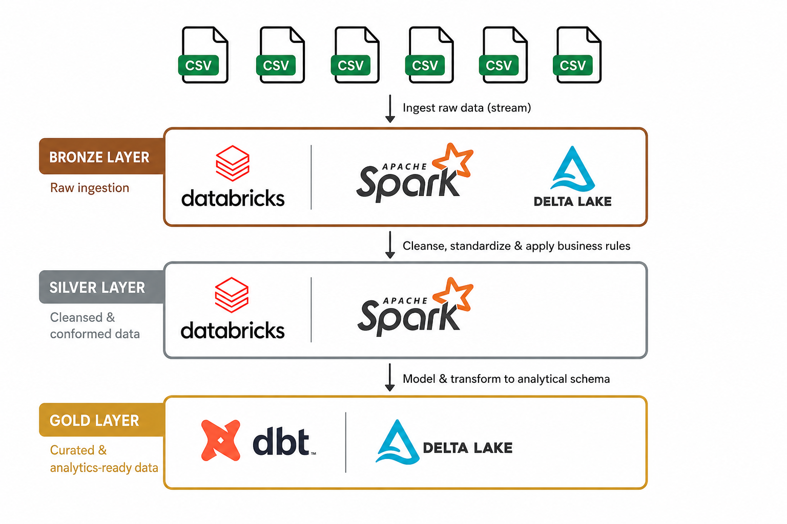
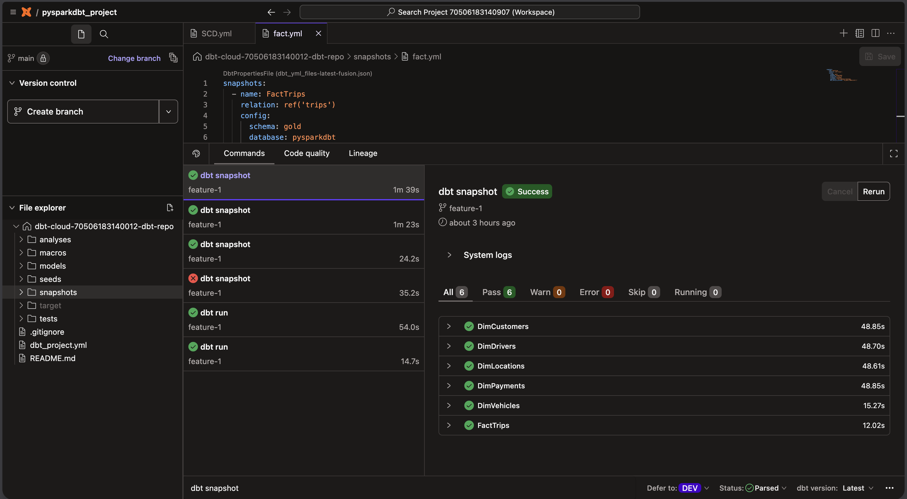
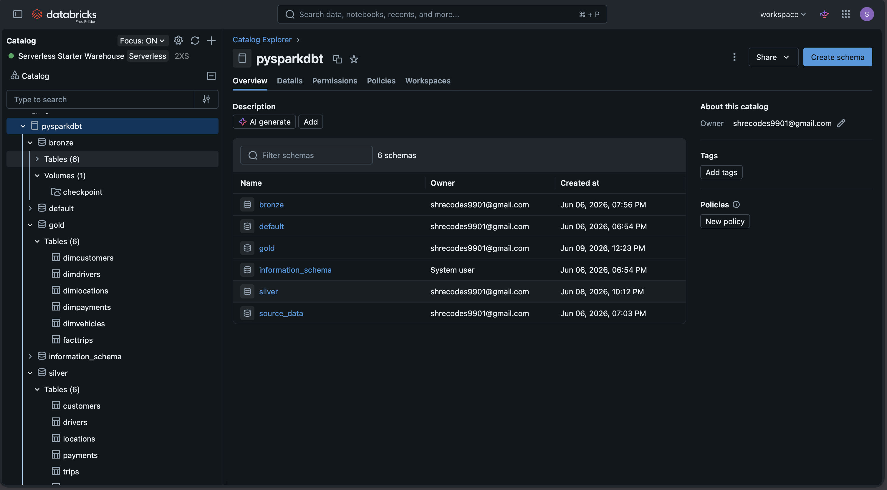

# Uber Rides Medallion ETL Pipeline
### Databricks · PySpark · dbt Cloud · Delta Lake · Star Schema

An end-to-end data engineering pipeline built on Databricks using a **Medallion Architecture** (Bronze → Silver → Gold). The project ingests synthetic Uber ride data across 6 entities, applies layered transformations using PySpark and dbt Cloud, and materializes a star schema with a fact table and SCD Type 2 dimension snapshots.

---

## Architecture Overview



---

## Dataset

Synthetic Uber rides dataset with 6 related entities simulating a real-world ride-hailing platform.

| Entity | Records | Key Columns |
|---|---|---|
| `trips` | 1,000 | trip_id, driver_id, customer_id, vehicle_id, distance_km, fare_amount, trip_status, last_updated_timestamp |
| `payments` | 1,000 | payment_id, trip_id, customer_id, payment_method, payment_status, amount, transaction_time |
| `customers` | 200 | customer_id, first_name, last_name, email, phone_number, city, signup_date |
| `drivers` | 50 | driver_id, first_name, last_name, phone_number, vehicle_id, driver_rating, city |
| `locations` | 50 | location_id, city, state, country, latitude, longitude |
| `vehicles` | 50 | vehicle_id, license_plate, model, make, year, vehicle_type |

> All entities include a `last_updated_timestamp` column used for incremental loading and SCD Type 2 change tracking.

---

## Tech Stack

| Layer | Technology | Purpose |
|---|---|---|
| Compute | Databricks (Serverless, 2XS) | Notebook execution + Delta Lake host |
| Ingestion | Spark Structured Streaming | Bronze layer streaming ingestion |
| Storage | Delta Lake | ACID-compliant table format across all layers |
| Transformation | PySpark | Silver layer entity transformations |
| Modeling | dbt Cloud | Gold layer models, snapshots, macros |
| Orchestration | dbt Cloud Jobs | Pipeline scheduling and execution |
| Version Control | Git (dbt Cloud integrated) | Branch-based development (main + feature-1) |
| Catalog | Databricks Unity Catalog | Schema and table governance |

---

## Project Structure

```
pyspark-dbt-project/
│
├── bronze/
│   └── BRONZE_INGESTION_LAYER.ipynb      # Spark Structured Streaming ingestion
│
├── silver/
│   └── SILVER_TRANSFORMATION_LAYER.ipynb # PySpark entity transformations
│
├── gold_dbt_transformations/
│   ├── dbt_project.yml                   # Project config + materialization settings
│   │
│   ├── models/
│   │   ├── silver/
│   │   │   └── trips.sql                 # Incremental fact table
│   │   └── source/                       
│   │       └── source.yml            
│   │
│   ├── snapshots/
│   │   ├── SCD.yml                       # SCD Type 2 dimension snapshots (5 dims)
│   │   └── fact.yml                      # FactTrips snapshot config
│   │
│   └── macros/
│       └── generate_schema_name.sql      # Custom schema name override macro
│
├── data/
│   ├── customers.csv
│   ├── drivers.csv
│   ├── locations.csv
│   ├── payments.csv
│   ├── trips.csv
│   └── vehicles.csv
│
├── screenshots/
│   ├── dbt_cloud_snapshots_passing.png   # All 6 snapshots passing in dbt Cloud
│   └── databricks_unity_catalog.png      # All 3 layers materialized in Databricks
│
└── README.md
```

---

## Implementation Details

### Bronze Layer — Spark Structured Streaming

The Bronze layer ingests all 6 CSV entities into Delta Lake tables using Spark Structured Streaming. Schema is first inferred via a batch read, then applied to the stream for type safety. Each entity writes to its own Delta table with an independent checkpoint location for fault tolerance.

**Key design decisions:**
- `trigger(once=True)` enables batch-stream hybrid execution — processes all available data in one run, then stops. Suitable for scheduled pipeline runs without a persistent streaming job.
- Per-entity checkpoints ensure independent failure recovery — a failed entity does not affect others.
- Delta format enables ACID transactions and time travel on Bronze tables.

---

### Silver Layer — PySpark Transformations

The Silver layer applies modular, entity-level transformations in Databricks notebooks. Each entity has its own transformation logic covering data cleaning, type standardisation, null handling, and business rule application. Outputs are written to `silver.{entity}` Delta tables.

---

### Gold Layer — dbt Cloud Modeling

The Gold layer is fully managed by dbt Cloud, connected to Databricks via a native integration. The layer implements a **star schema** with one fact table and five dimension tables.

#### Fact Table — Incremental Materialization

`FactTrips` uses dbt's incremental materialization pattern with `last_updated_timestamp` as the watermark. Only new or updated records are processed on each run, avoiding full table scans.

#### Dimension Tables — SCD Type 2 Snapshots

All five dimension tables are implemented as SCD Type 2 snapshots using dbt's `snapshot` block with timestamp strategy. Historical records are preserved with `dbt_valid_from` / `dbt_valid_to` columns. Active records have `dbt_valid_to = '9999-12-31'`.

Dimensions tracked: **DimCustomers, DimDrivers, DimLocations, DimPayments, DimVehicles**

#### Custom Schema Name Macro

A custom Jinja macro overrides dbt's default schema naming behaviour, ensuring Gold layer models land in the correct `gold` schema rather than a prefixed schema name.

---

## Star Schema Design

```
                    ┌─────────────────┐
                    │   DimCustomers  │
                    │ (SCD Type 2)    │
                    └────────┬────────┘
                             │
┌─────────────┐    ┌─────────┴────────┐    ┌─────────────────┐
│  DimDrivers │    │    FactTrips     │    │  DimLocations   │
│ (SCD Type 2)├────┤  (Incremental)   ├────┤  (SCD Type 2)   │
└─────────────┘    └────────┬─────────┘    └─────────────────┘
                            │
              ┌─────────────┴──────────────┐
              │                            │
   ┌──────────┴──────┐          ┌──────────┴──────┐
   │   DimVehicles   │          │   DimPayments   │
   │  (SCD Type 2)   │          │  (SCD Type 2)   │
   └─────────────────┘          └─────────────────┘
```

---

## Pipeline Execution Evidence

### dbt Cloud — All 6 Snapshots Passing (6/6 Pass, 0 Errors)



All dimension and fact snapshots ran successfully on the `feature-1` branch, with execution times between 12–49 seconds per model.

### Databricks Unity Catalog — All Three Layers Materialized



The `pysparkdbt` catalog in Databricks Unity Catalog shows all three schemas (bronze, silver, gold) with their respective tables materialized. The `source_data` schema confirms data lineage tracking via dbt sources.

| Schema | Tables | Created |
|---|---|---|
| bronze | 6 (+ checkpoint volume) | Jun 06, 2026 |
| silver | 6 | Jun 08, 2026 |
| gold | 6 (dimcustomers, dimdrivers, dimlocations, dimpayments, dimvehicles, facttrips) | Jun 09, 2026 |

---

## Key Engineering Patterns Demonstrated

| Pattern | Implementation |
|---|---|
| Medallion Architecture | Three-layer Bronze → Silver → Gold with separation of concerns |
| Streaming Ingestion | Spark Structured Streaming with Delta sink and checkpoint recovery |
| Batch-Stream Hybrid | `trigger(once=True)` for scheduled batch runs using streaming API |
| Incremental Loading | dbt incremental model with watermark-based deduplication |
| SCD Type 2 | dbt snapshot with timestamp strategy across all 5 dimensions |
| Star Schema | 1 fact table + 5 dimension tables in Gold layer |
| Data Lineage | dbt sources YAML connecting Gold models back to Bronze origin |
| Schema Governance | Databricks Unity Catalog with custom dbt schema macro |
| Modular Code | Entity-level notebook separation in Silver; model-level separation in Gold |

---

## How to Run

### Prerequisites
- Databricks workspace with Unity Catalog enabled
- dbt Cloud account connected to Databricks via Partner Connect
- Source CSV files uploaded to `/Volumes/pysparkdbt/source_data/data_files/{entity}/`

### Execution Order

```bash
# Step 1 — Bronze: Run BRONZE_INGESTION_LAYER notebook in Databricks
# Streams all 6 entities into Delta bronze.{entity} tables

# Step 2 — Silver: Run SILVER_TRANSFORMATION_LAYER notebook in Databricks  
# Transforms bronze tables into silver.{entity} Delta tables

# Step 3 — Gold: Run dbt commands in dbt Cloud
dbt run       # Materializes FactTrips incremental model
dbt snapshot  # Runs all 5 SCD Type 2 dimension snapshots
dbt test      # Validates data quality across models
```

---

## Author

**Shreyash Sahare**  
MS in Data Science @ University of Colorado Boulder | B.Tech in ECE @ NIT Trichy
